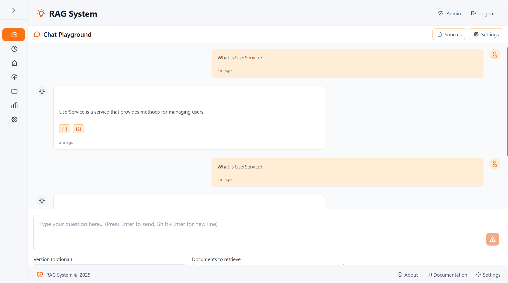
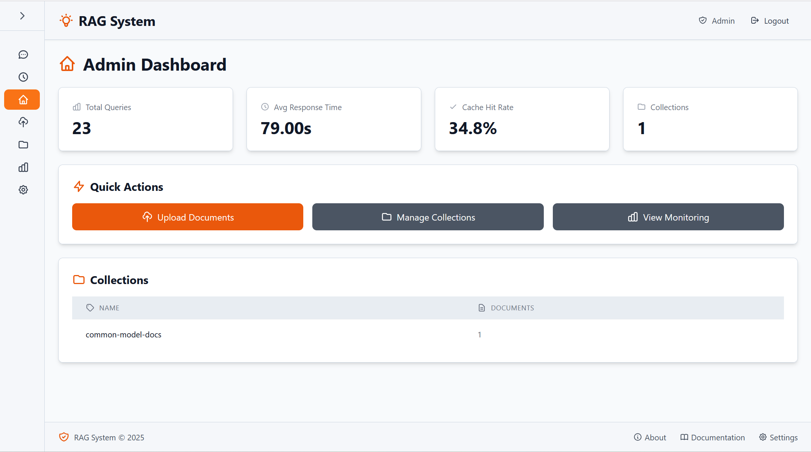
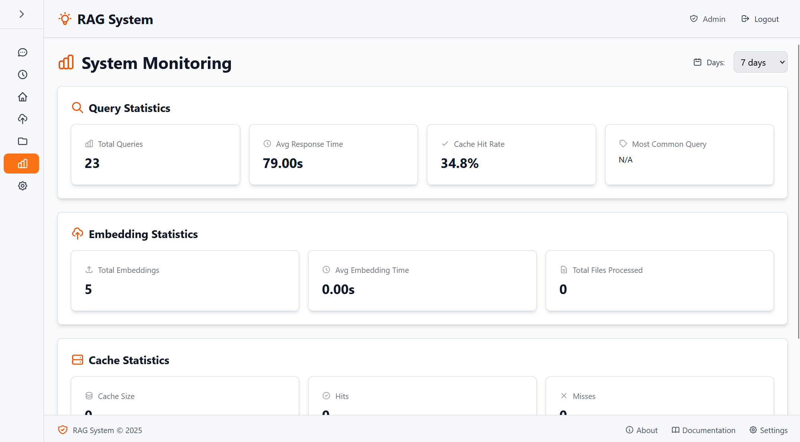

# 🚀 RAGU - Retrieval-Augmented Generation Universal

<div align="center">

**RAGU (Retrieval-Augmented Generation Universal) - A modern, local RAG application with a beautiful web interface**

[](https://adoptium.net/)
[](https://angular.io/)
[](https://ollama.ai/)
[](LICENSE)

[Quick Start](#-quick-start) • [Features](#-features) • [Documentation](#-documentation) • [API Reference](docs/API_REFERENCE.md) • [Task Tracking](.github/TASK_TRACKING.md)

</div>

---

## ✨ Overview

RAGU (Retrieval-Augmented Generation Universal) is a powerful, privacy-focused documentation search and query platform that enables semantic search across your documentation using local AI models. With a modern Angular web interface, you can upload documents, import from Confluence, query your knowledge base, and manage collections—all while keeping your data completely local.

### 🎯 Key Highlights

- 🌐 **Modern Web UI** - Beautiful, intuitive interface built with Angular
- 📄 **Document Upload** - Support for PDF, HTML, TXT, Markdown, and more
- 🔗 **Confluence Integration** - Import pages directly from Confluence
- 🔍 **Semantic Search** - Natural language queries with context-aware responses
- 📊 **Version Management** - Track and query multiple documentation versions
- 🔒 **Privacy First** - All processing happens locally on your machine
- ⚡ **Fast & Efficient** - Query caching and optimized retrieval

---

## 📸 Screenshots

<div align="center">



*Chat Playground - Interactive chat interface for querying your documentation with natural language*



*Admin Dashboard - System overview and quick actions*



*System Monitoring - Query analytics and performance metrics*

</div>

---

## 🎯 Features

### Core Capabilities

- **📤 Document Upload & Import**
  - Upload multiple file formats (PDF, HTML, TXT, Markdown)
  - Import Confluence pages via page ID or URL
  - **Web Scraping**: Crawl and embed entire documentation sites
  - Batch processing for multiple files
  - Incremental updates without data loss

- **🔍 Intelligent Querying**
  - Natural language question answering
  - Multi-version querying across documentation versions
  - Version comparison for tracking changes
  - Query history and favorites management
  - Source citations with document references

- **📊 Management & Monitoring**
  - Collection management with version tracking
  - Query analytics and statistics
  - Performance monitoring
  - Export query history (JSON/CSV)

- **⚙️ Configuration & Integration**
  - Multiple LLM provider support (Ollama, OpenAI, Anthropic, Azure, Google, OpenRouter)
  - Configurable embedding providers (Ollama, OpenRouter, OpenAI, Azure, Google)
  - OpenRouter support for both LLM and embeddings (OpenAI-compatible API)
  - Confluence integration settings
  - System settings management
  - Optional API authentication

### Web Interface Features

- **🎨 Modern UI/UX**
  - Clean, responsive design
  - Intuitive navigation
  - Real-time feedback
  - Helpful tooltips and icons
  - Error handling with clear messages

- **📱 Pages**
  - **Chat Playground** - Interactive chat interface for querying documentation
  - **History** - View and rerun previous queries
  - **Dashboard** - System overview and quick actions
  - **Upload & Import** - Document upload and Confluence import
  - **Collections** - Manage your document collections
  - **Monitoring** - System statistics and analytics
  - **Settings** - Configure LLM providers, Confluence, and system settings

---

## 📋 Prerequisites

Before you begin, ensure you have:

- **Java 21** (Temurin, Corretto or Oracle) – `java -version`
- **Maven** (the wrapper `./mvnw` is included, no global install required)
- **Node.js 18+** and **npm** (for the Angular UI)
- **[Ollama](https://ollama.ai/)** installed and running locally
- **Docker & Docker Compose** (for containerized deployments)
- **Minimum 8GB RAM** (16GB+ recommended) and **10GB+ disk space** for models/vector data

---

## 🚀 Quick Start

### 1. Install Ollama

```bash
curl -fsSL https://ollama.ai/install.sh | sh
ollama --version
```

### 2. Download Required Models

```bash
ollama pull mistral
ollama pull nomic-embed-text
ollama list
```

### 3. Build the Java Backend

```bash
cd java-backend
./mvnw clean package
```

This produces `target/quarkus-app/` containing the runnable application.

### 4. Run the Backend (Development)

```bash
cd java-backend
./mvnw quarkus:dev
```

The API will be available at http://localhost:8080 with live reload.

### 5. Run the Backend (Production Style)

```bash
cd java-backend
java -jar target/quarkus-app/quarkus-run.jar
```

### 6. Set Up the Web UI

```bash
# Navigate to web UI directory
cd web-ui

# Install Node.js dependencies
npm install

# Build the application
npm run build

# Or run in development mode
npm start
```

### 7. Configure Environment (optional)

```bash
cp .env.example .env
# update values such as AUTH credentials, Redis URL, etc.
```

### 8. Run the Full Stack with Docker Compose

```bash
# Ensure the backend is packaged first
cd java-backend
./mvnw package -DskipTests
cd ..

# Start backend + redis
docker compose up --build backend redis

# Start frontend (development) in another terminal
docker compose up frontend-dev
```

For a simple production-like stack:

```bash
docker compose up --build backend frontend-prod redis -d
```

**Service URLs**

- Backend API: http://localhost:8080
- Frontend (dev): http://localhost:4200
- Frontend (prod): http://localhost:80
- Metrics: http://localhost:8080/q/metrics
- Health: http://localhost:8080/q/health/ready

---

## 📖 Usage

### Web Interface

1. **Access the Web UI**: Open `http://localhost:4200` in your browser
2. **Upload Documents**: Navigate to "Upload & Import" → "Upload Documents" tab
3. **Import from Confluence**: Use "Confluence Import" tab (configure Confluence settings first)
4. **Query Documentation**: Go to "Query" page and ask questions
5. **Manage Collections**: View and manage collections in "Collections" page

### API Usage

#### Health Check
```bash
curl http://localhost:8080/health
```

#### Embed a File
```bash
curl -X POST http://localhost:8080/embed \
  -F "file=@documentation.pdf" \
  -F "version=1.2.3"
```

#### Import from Confluence
```bash
curl -X POST http://localhost:8080/confluence/import \
  -H "Content-Type: application/json" \
  -d '{
    "page_id": "123456",
    "version": "1.2.3",
    "overwrite": false
  }'
```

#### Query Documentation
```bash
curl -X POST http://localhost:8080/query \
  -H "Content-Type: application/json" \
  -d '{
    "query": "How do I use the UserService class?",
    "version": "1.2.3",
    "k": 3
  }'
```

#### Monitor Health & Metrics
```bash
curl http://localhost:8080/q/health/ready | jq
curl http://localhost:8080/q/metrics | head
```

## 🏗️ Project Structure

```
ragu/
├── java-backend/                # Quarkus backend service
│   ├── src/main/java/ai/ragu    # API + services
│   ├── src/main/resources/      # application.properties
│   └── src/main/docker/         # Container definitions
├── web-ui/                      # Frontend Angular application
│   ├── src/
│   │   ├── app/
│   │   │   ├── features/        # Feature modules
│   │   │   │   ├── admin/       # Admin features (dashboard, upload, collections, etc.)
│   │   │   │   ├── query/       # Query interface
│   │   │   │   └── auth/        # Authentication
│   │   │   ├── core/            # Core services and state
│   │   │   ├── layout/          # Layout components
│   │   │   └── shared/          # Shared components
│   │   └── ...
│   └── ...
├── docs/                        # Documentation
│   ├── API_REFERENCE.md         # Complete API documentation
│   └── DEVELOPER_GUIDE.md      # Developer guide
├── .env.example                 # Environment configuration example
└── README.md                    # This file
```

---

## 🔧 Configuration

### Environment Variables

Key configuration options in `.env`:

```bash
# Backend dependencies
RAGU_DEPENDENCIES_REDIS=redis://localhost:6379/0
RAGU_DEPENDENCIES_KAFKA=localhost:29092
RAGU_DEPENDENCIES_QDRANT=http://localhost:6333

# HTTP
QUARKUS_HTTP_PORT=8080
QUARKUS_HTTP_HOST=0.0.0.0

# Authentication
RAGU_AUTH_ENABLED=false
RAGU_AUTH_USERNAME=admin
RAGU_AUTH_PASSWORD=changeme
RAGU_AUTH_API_KEY=unset
RAGU_RATE_LIMIT_READ_PER_MINUTE=60
RAGU_RATE_LIMIT_WRITE_PER_MINUTE=30

# Document processing
RAGU_DOCUMENT_CHUNK_SIZE=1000
RAGU_DOCUMENT_CHUNK_OVERLAP=200
```

### Web UI Configuration

The web UI connects to the backend API. Configure the API URL in `web-ui/src/environments/environment.ts`:

```typescript
export const environment = {
  apiUrl: 'http://localhost:8080'
};
```

### Confluence Integration

Configure Confluence settings via the web UI (Settings → Confluence Integration) or via API:

```bash
curl -X POST http://localhost:8080/settings/confluence \
  -H "Content-Type: application/json" \
  -d '{
    "url": "https://your-domain.atlassian.net",
    "username": "your-email@example.com",
    "api_token": "your-api-token"
  }'
```

---

## 🔒 Security Features

- **Path Traversal Protection** - File paths are sanitized and validated
- **Input Validation** - All API inputs are validated before processing
- **Error Handling** - Comprehensive error handling with appropriate HTTP status codes
- **Local Processing** - All data stays on your machine
- **API Authentication** (Optional) - API key-based authentication for production use
- **Write Protection** - Configurable authentication for write operations only
- **Session Security** - Secure session management for web UI

---

## 📚 Documentation

### Quick Links

- **[Quick Start Guide](QUICKSTART.md)** - Get up and running in 5 minutes
- **[API Reference](docs/API_REFERENCE.md)** - Complete API endpoint documentation
- **[Developer Guide](docs/DEVELOPER_GUIDE.md)** - Architecture and extension guide
- **[Changelog](CHANGELOG.md)** - Version history and changes
- **[Cutover Runbook](docs/CUTOVER_RUNBOOK.md)** - Staged rollout + rollback plan for the Java backend

### Key Endpoints

- `POST /embed` - Embed a single file
- `POST /embed-batch` - Embed multiple files
- `POST /confluence/import` - Import Confluence page
- `POST /query` - Query documentation
- `POST /query/multi-version` - Query across multiple versions
- `GET /collections` - List all collections
- `GET /stats` - System statistics
- `GET /history` - Query history
- `GET /q/health/ready` - Readiness probe (includes Redis/Kafka/Qdrant)
- `GET /q/metrics` - Prometheus-formatted Micrometer metrics

For complete API documentation, see [API_REFERENCE.md](docs/API_REFERENCE.md).

---

## 📡 Observability & Logging

- **Health**: `GET /q/health`, `/q/health/ready`, and `/q/health/live` expose dependency checks.
- **Metrics**: Micrometer Prometheus registry is available at `/q/metrics` and includes counters (e.g., `ragu_embedding_requests`, `ragu_query_requests`, `ragu_scrape_tasks`) and timers for latency insight.
- **Logs**: Structured JSON logs are enabled by default (`LOG_JSON=true`). Override at runtime with `LOG_JSON=false` or change verbosity via `LOG_LEVEL`.
- **Dashboards**: See [docs/DOCKER_GUIDE.md](docs/DOCKER_GUIDE.md#observability--monitoring) for Prometheus/Loki/Grafana instructions.

---

## 🧪 Testing

```bash
# Backend unit/integration tests
cd java-backend
./mvnw test

# Frontend tests
cd web-ui
npm test
```

Highlights:
- `PhaseSevenIntegrationTest` exercises `/embed`, `/query`, and `/embed-url` end-to-end using RestAssured.
- Micrometer-aware unit tests cover `EmbeddingPipeline`, `RagService`, and `ScrapeTaskService`.

Quarkus generates reports under `java-backend/target/surefire-reports` and Angular coverage reports under `web-ui/coverage`.

---

## 🐛 Troubleshooting

### Common Issues

**Ollama not found**
- Ensure Ollama is installed and in your PATH
- Check that `ollama serve` is running
- Verify with `ollama list`

**Models not available**
- Run `ollama pull mistral` and `ollama pull nomic-embed-text`
- Verify with `ollama list`

**Backend build errors**
- Run `cd java-backend && ./mvnw clean package -DskipTests`
- Ensure Java 21 is installed and on your PATH (`java -version`)
- Delete `java-backend/target` if the build cache is corrupted

**Port already in use**
- Change `API_PORT` in `.env` file
- Or stop the process using port 8080

**Web UI not connecting to backend**
- Verify backend is running on the configured port
- Check CORS settings if accessing from different origin
- Verify API URL in environment configuration

**Confluence import fails**
- Verify Confluence settings are configured correctly
- Ensure API token has read permissions for the page
- Check backend logs for detailed error output

---

## 🛠️ Development

### Running in Development Mode

**Backend:**
```bash
cd java-backend
./mvnw quarkus:dev
# API available at http://localhost:8080 with live reload
```

**Frontend:**
```bash
cd web-ui
npm start
# Access at http://localhost:4200
```

### Building for Production

**Backend:**
```bash
cd java-backend
./mvnw clean package
java -jar target/quarkus-app/quarkus-run.jar
```

**Frontend:**
```bash
cd web-ui
npm run build
# Output in web-ui/dist/
```

---

## 📄 License

See [LICENSE](LICENSE) file for details.

---

## 🙏 Acknowledgments

- Inspired by the LangChain community’s Retrieval Cookbook and RAG best practices.
- Uses [Ollama](https://ollama.ai/) for local LLM
- Uses [ChromaDB](https://www.trychroma.com/) for vector storage
- Uses [LangChain](https://www.langchain.com/) for RAG orchestration
- Uses [Angular](https://angular.io/) for the web interface

---

<div align="center">

**Made with ❤️ for developers who value privacy and local processing**

[Report Bug](https://github.com/your-org/ragu/issues) • [Request Feature](https://github.com/your-org/ragu/issues) • [Documentation](docs/)

</div>
